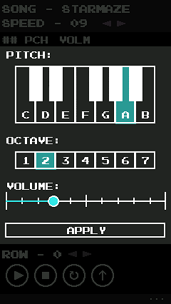
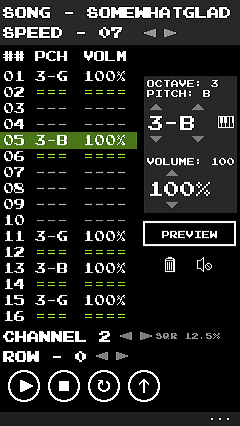
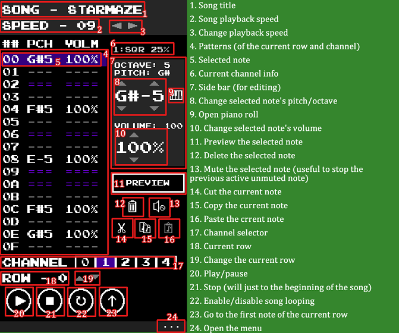
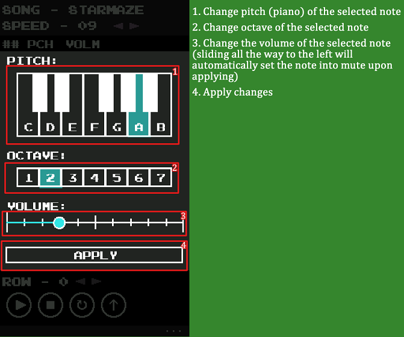

# 8Tones


The 8-bit music sequencer written in GML

### What is 8Tones?
 8Tones is a psudo 8-bit music sequencer (similar to [Famitracker](https://github.com/HertzDevil/0CC-FamiTracker)) written by @HypernovaTX back around 2015-2016 with Game Maker Studio 1.4 (GML). Initially it was a music maker made for Windows Phone 8.1, I also ported the application to both iOS and Android due to demand. Like Famitracker, it is a sequence tracker that produces 8-Bit music. Unlike true NES 8-bit (2A03)\*, I coded this in 5 channels:
> * 12.5% square
> * 25% square wave
> * 50% square wave
> * Triangle wave
> * Beat channel (consts of pre-made noise/DPCM beats)

> \* 2A03 is consist of: 2 square channels, 1 triangle channel, 1 noise channel, and 1 DPCM channel

 In addition, this application also produces TXT file that can be imported to Famitracker (2A03 with MM5 expansion).
 
### Screenshots/UI





[Video Demonstration](https://www.youtube.com/watch?v=A7rM7G9tHGE)
 
### What happened to the application?
 I finished the project in August 2016 but looking to add more features to it. Unfortunately in 2018, I have to cancel this project due to the following reasons:
- Game Maker's run time is highly inefficient, which result in latencies like timing and audio sample
- Microsoft discontinued Windows Mobile platform
- Yoyo Games no longer makes update for Game Maker Studio 1.4. Therefore Google Play and Apple iTunes Connect won't accepting these anymore since GMS 1.4 can only take older SDKs
- Financial hardships to maintain a server and acquire Game Maker Studio 2
Please understand that my codes were nowhere as good as it is back then compared to now, you will expect spaghetti code on this. However, I have plans to create a spiritual successor of this project in Javascript.

### Can I continue this project?
You are welcome to use continue this project as long as my name is being credited as the original author.

### Online implementations guide:
##### What do I need?
- A server that allows external POST requests (I don't recommend free hosting services like Byethost since they blocks it)
- It is best to run it with the latest version of PHP and MySQL/MariaDB (As for September 2020)

##### How to set up the server connection?
1. In the GMX file, go to `o_online_loader` > Create Event > `INIT` Code and change the 2 variables:
```GML
BASEURL = "https://TheServerURL.toconnect";
salt = "PUT SALT HERE";
```
2. Start a server and create a database and a user that has read/write privileges.
3. Create a table based on this query:
```sql
CREATE TABLE IF NOT EXISTS `share` (
  `map` text CHARACTER SET utf8 COLLATE utf8_unicode_ci NOT NULL,
  `name` text CHARACTER SET utf8 COLLATE utf8_unicode_ci NOT NULL,
  `author` text CHARACTER SET utf8 COLLATE utf8_unicode_ci NOT NULL,
  `id` varchar(64) CHARACTER SET utf8 COLLATE utf8_unicode_ci NOT NULL,
  `time_stamp` int(11) NOT NULL,
  `password` varchar(64) CHARACTER SET utf8 COLLATE utf8_unicode_ci NOT NULL,
  KEY `id` (`id`),
  FULLTEXT KEY `map` (`map`)
) ENGINE=MyISAM DEFAULT CHARSET=latin1;
```
3. Upload all of the PHP files to the server's root `public_html` directory.
4. Make sure to update all of SQL database connection settings in the first line for each of the PHP files:
```php
$con = mysqli_connect("localhost","DB_USER","DB_USER_PASSWORD","DATABASE");
```
NOTE: Special thanks to [Zack Banack](https://github.com/zbanack) for helping me on the backend PHP and MySQL.
